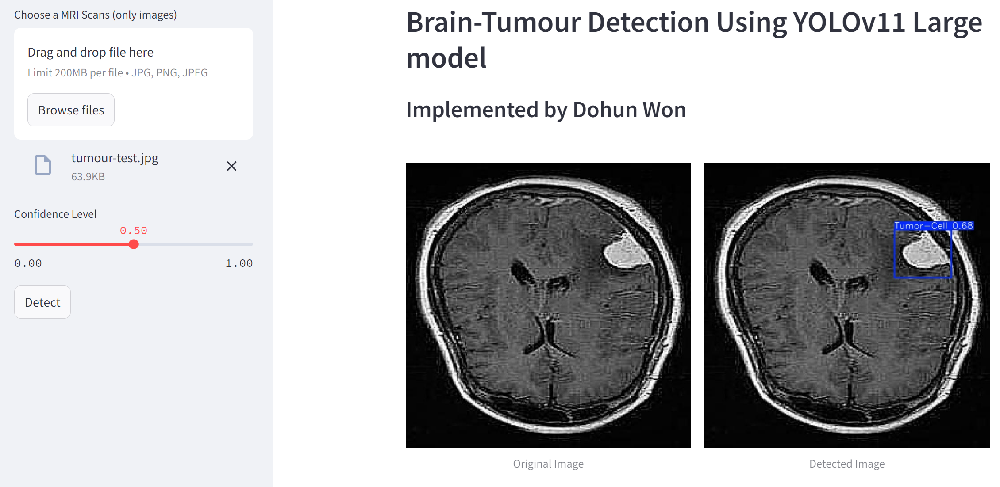

# Brain-Tumour Detection Using YOLOv11 Large Model

This project implements a brain tumor detection system using a YOLOv11 large model. It is designed to analyze MRI scans and detect the presence of brain tumors with high accuracy. The model is implemented using Python, leveraging the `ultralytics` library for YOLO, and is wrapped in a simple interface using `Streamlit` for easy interaction.

## Table of Contents

- [Introduction](#introduction)
- [Features](#features)
- [Example](#example)
- [Installation](#installation)
- [Usage](#usage)
- [Model Details](#model-details)
- [Performance](#performance)
- [Contributors](#contributors)

## Introduction

Brain tumor detection is a critical application in medical imaging and diagnostics. This project aims to provide a lightweight and efficient solution using a state-of-the-art YOLOv11 model. The model is trained to detect tumor cells in MRI scan images with high precision and recall.

The user interface allows users to upload MRI scans, set the desired confidence level, and run the detection with the click of a button. The system displays both the original and the detected image side by side for easy comparison.

## Features

- **YOLOv11-based Tumor Detection**: Utilizes the latest version of the YOLO model for high-performance detection.
- **Interactive User Interface**: Built with `Streamlit`, the app provides a simple interface to upload MRI images and visualize detection results.
- **Configurable Confidence Levels**: Allows users to set the desired confidence level for the tumor detection results.
- **Side-by-Side Image Comparison**: Displays the original MRI scan and the image with detected tumor cells.

## Example

Here is an example of the brain tumour detection in action:

### Original Image:


## Installation

### Prerequisites

Ensure you have Python 3.10 or above installed on your system.

### Steps

1. **Clone the repository**:
    ```bash
    git clone https://github.com/wdh70743/brain-tumour-detection.git
    cd brain-tumour-detection
    ```

2. **Install the required packages**:
    You can install the required Python packages by running:
    ```bash
    pip install -r requirements.txt
    ```

3. **Download the pre-trained YOLO model weights**:
    - Place the `last.pt` model in the `models/` directory.
    - You can use the model weights in the models folder or use custom-trained weights.

4. **Run the application**:
    ```bash
    streamlit run app.py
    ```

## Usage

1. Open the app by running the above command.
2. Use the sidebar to upload MRI images (`jpg`, `jpeg`, `png` formats).
3. Set the desired confidence level for detection.
4. Click the `Detect` button to run the YOLOv11 model on the image.
5. The app will display the original image on the left and the detected image on the right.

## Model Details

- **Model**: YOLOv11 (trained using custom dataset).
- **Input Size**: 640 x 640 (configurable).
- **Class Detected**: Tumor-Cell.
- **Pre-trained Model**: The model uses pre-trained weights (`last.pt`).

## Performance

- **Precision**: `0.95`
- **Recall**: `0.93`
- **mAP50**: `0.96`
- **mAP50-95**: `0.52`

The model is capable of detecting tumor cells with a high degree of precision and recall, making it suitable for diagnostic assistance in medical settings.

## Contributors

- **Dohun Won** - UTS IT Student and Data Scientist Intern.
